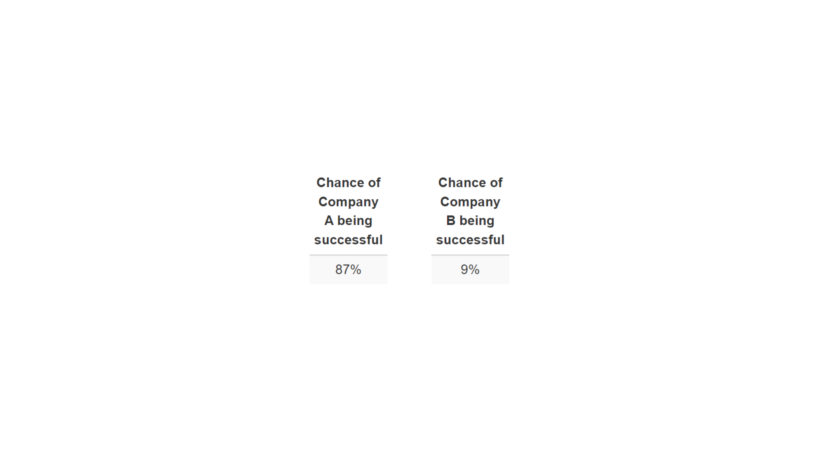

# Emilio Conde Portfolio

# [Project 1: Predicting Startups Success](Founder-Analysis)

This project examines the key differences between businesses started by one person and those started by a team of co-founders. The goal is to figure out what makes a company successful and what might cause it to close or face acquisition. 

* Data was taken from Pitchbook Platform and extracted via web scraping through entrepreneur's LinkedIn profiles.
* Includes differences between funding rounds, funding location, skill comparison across teams, and more.
* Model was built using logistic regression
* 90%+ accuracy across both training and testing datasets.
* Predictions were made on data from real companies

### Time to move across rounds:

### Correlation between experience years as entrepreneurs vs. funding rounds:

### Area Under the Curve for logistic regression model:

### Predictions on real world data:

# Project 2: LinkedIn Company Demographics Scrapper

# Project 3: Multidimensional Poverty in Mexico
