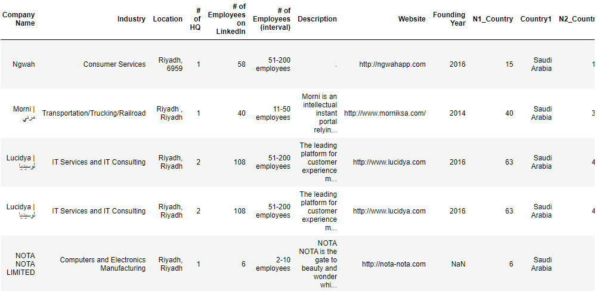

# Emilio Conde Data Science Portfolio

# [Predicting Startups Success](https://github.com/MrCondeMx/emilio_portfolio/tree/main/Founder-Analysis)
*Note: The output is in an HTML file. For accurate visualization, please download the file.*

This project examines the key differences between businesses started by one person and those started by a team of co-founders. The goal is to figure out what makes a company successful and what might cause it to close or face acquisition. 

* Data was taken from Pitchbook Platform and extracted via web scraping through entrepreneur's LinkedIn profiles.
* Includes differences between funding rounds, funding location, skill comparison across teams, and more.
* Model was built using logistic regression
* 90%+ accuracy across both training and testing datasets.
* Predictions were made on data from real companies

### Time to move across rounds:

### Correlation between experience years as entrepreneurs vs. funding rounds:

### Area Under the Curve for logistic regression model:

### Predictions on real world data:

# [LinkedIn Company Demographics Scrapper](https://github.com/MrCondeMx/emilio_portfolio/tree/main/LinkedIn-Company-Scraper)

This project significantly enhanced the efficiency of data scraping from company profiles, providing tangible benefits to Endeavor Mexico.

* The code is fully prepared for use and deployment across different computers. *Note for first-time Selenium users: Please ensure to install necessary libraries to prevent any errors.*
* Code only needs a list with the URLs to retrieve in a .csv format.
* Added value: The scraper retrieves comprehensive employee demographic information, including locations, majors, skills, and occupations.
* Executing all the provided code will yield a clean, ready-to-analyze data frame for any required analysis.

### Top majors for a company:

### Data Frame output:

# [Sports Analytics](https://github.com/MrCondeMx/emilio_portfolio/tree/main/Sports_Analytics)
Here you can find my sports related projects. I love sports and I love combining my passion for data with my main hobby
### Luka Doncic 60 point game shot chart:
* Luka had a record-breaking game on december 27, 2022. What was his shot selection and shot making during that game? 

